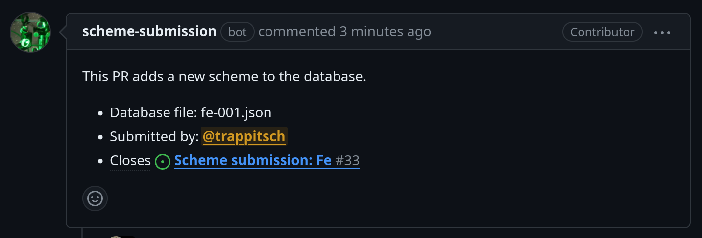
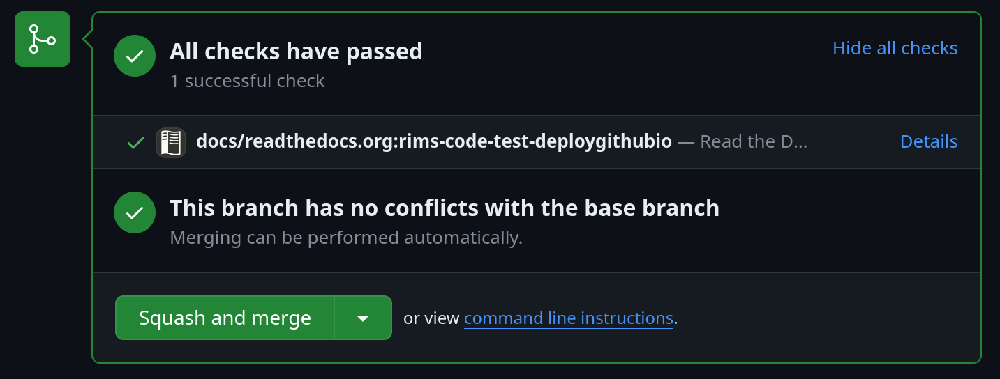

## Add a scheme received by e-mail

If you have received a scheme by e-mail, 
there are two possibilities:

1. The `json` file is given inline (inside the e-mail body):
   - Copy the content below the separator line
   - Create a new file with `.json` file ending
2. The `json` file is attached to the e-mail:
   - Download the attachment

Now you can go to the 
[submission mask](https://rims-code.github.io/rimsdb_scheme_submission/){:target="_blank"}
and upload the file via `Load config file` button.
Then go ahead and submit via GitHub and review the pull request as described below.

## Review a pull request for scheme addition

After a scheme is submitted as an issue,
a pull request (PR) is automatically generated.
All open pull requests can be found
[here](https://github.com/RIMS-Code/rims-code.github.io/pulls){:target="_blank"}.
Once a pull request is opened, 
the new `.json` file is added to the database
and the website is automatically re-generated. 
The new website is then added to the pull request by the bot.

The first thing to check for a maintainer is the PR summary, e.g.:

This information will be given at the top of the PR.
Here, we can see the following information:

- Which scheme is added? The file is `fe-001.json`, which will create the Fe-1 page.
- Who submitted the scheme?
- Which issue is linked to the scheme? Merging the PR will automatically close this issue.

For discussions with the original submitter, 
you should use the issue that triggered this PR.

The next step in the PR is to check the changes on the website.
To do so, go to the bottom where the checks are.
This section should look like this:

Make sure that there is only one check from `readthedocs` as displayed here.
If two checks are there or checks are in orange (still running),
wait until the checks are finished.
To see the draft website, click on `Details` in the `readthedocs` check.
Then make sure that the website looks as expected, 
especially the newly added scheme (here Fe-1).

If the website has issues, you have two options:

- Fix them manually by editing the `.json` file in the PR.
- Ask the submitter to fix the issues and update the PR.

You can also discuss with the submitter if there are open questions
or if there is something that needs to be clarified.

!!! note 

    If checks fail, something looks off that has nothing to do with the new scheme,
    please add Reto to the PR and/or issue by posting a comment and 
    mentioning him with `@trappitsch`.

Once everything looks great, you can merge the PR 
by clicking the `Squash and merge` button.
This will merge the PR into the main branch, 
close the issue, 
and deploy the modified website.

## Add / Edit a static site

The website is generated using 
[mkdocs](https://www.mkdocs.org/){:target="_blank"}.
All pages of the documentation are hosted in the `docs` folder. 

!!! danger
   
   Do not edit anything in the `docs/schemes` folder directly.
   All the files in this folder are generated automatically
   by the website generating `python` code.

All static pages, like, e.g., this one,
can be modified directly and then commited again to the repository.

Please always create a pull request to add new pages or edit existing ones.
This ensures that the website generator is run and changes are checked.
