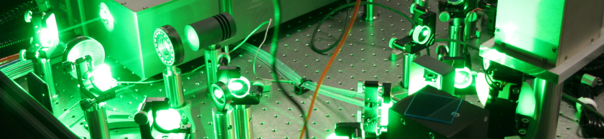

# Welcome to the RIMS-Code website

Here you find an assortment of resources and tools 
that are all loosely related 
to resonance ionization 
and resonance ionization mass spectrometry.
Below is a list of some resources 
that you can find here:

- [Resonance Ionization Scheme Database](schemes/schemes.md)
- [Form to submit a new scheme for the database](schemes_static/submit_scheme.md)
- [Crystal angle calculator for second and third harmonic generation](tools/crystal-calculator.md)

This website is a community-driven effort, 
and we welcome any contributions!
Please let us know if you have any suggestions,
issues, 
or if you would like to contribute!
All code for tools and even the website generator itself
are available open source on [GitHub](https://github.com/RIMS-Code).

To get in touch with us,
you can open an 
[issue on GitHub](https://github.com/RIMS-Code/rims-code.github.io/issues),
start a 
[discussion](https://github.com/RIMS-Code/rims-code.github.io/discussions),
or get in touch with the [current maintainer(s)](about/maintainers.md) of the website and this community hub.
You can also find more information in the 
[Contribute](about/contribute.md) section.

Have fun and we hope you find the resources here useful!
