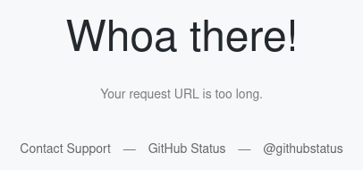

[**Click here to open the submission mask in a new tab.**](https://rims-code.github.io/rimsdb_scheme_submission){target="_blank"}

## How to submit a new scheme

To submit a new scheme,
you can use the input mask that can be found 
[here](https://rims-code.github.io/rimsdb_scheme_submission){target="_blank"}.
The input mask is fairly self-explanatory.
If you would like some help, 
below is a step-by-step guide on how to fill in the input mask.

!!! tip

    If you are curious how the submission mask looks filled-in for a specific page,
    go [to the database](https://github.com/RIMS-Code/rims-code.github.io/tree/main/db){target="_blank"} 
    and download the `json` file that has the same name as the scheme
    you are interested in.
    You can then load this config file into the submission mask 
    using the `Load config file` button.

    
    


### Filling in the various sections

!!! tip

    There are various usage sections in the program that can be extended.
    These give you more information on specific topics.

#### Notes


Here you can provide notes for the scheme that will be submitted.
These could be where the scheme was developed,
what tools were used, etc.
The notes will be displayed at the top of the scheme page.
*Adding notes is optional.*
In your notes, you can use markdown-style formatting, e.g.,
you can write a link as:

```markdown
[Link to RIMS-Code](https://rims-code.github.io)
```

This would render as: [Link to RIMS-Code](https://rims-code.github.io).

#### Scheme


In this section you can enter the used scheme.
The above example is the input for the [Ti-1 scheme](../schemes/ti/ti-001.md).
If you have previously drawn the scheme using `RIMSSchemeDrawer`
(see [here](../tools/rimsschemedrawer.md)),
you can load a saved config file using the button `Load config file`.
This button can also be used to load a previously saved submission config file.
Please double-check the entries to ensure everything was properly loaded.

Select the element for which you want to submit a scheme from the list.
This will automatically fill the ionization potential.

If the scheme does not start at 0 cm¯¹,
you can enter the required start value in the ground state level field.
Then select the unit how you want to enter the transitions. 
Possibilities are:

- `nm`: Wavelength of the individual step in nanometers.
- `cm¯¹`: Wave number of the level that is reached in this step.

The transitions themselves can be entered into the `Level` fields.

For each level, you can select a term-symbol.
Possible entries are `3F3`,
which will be automatically rendered as ³F₃.
Alternatively you can enter more complicated term symbols
using standard LaTeX formatting, e.g., `^3F_3`.

If you know the transition strength,
you can enter it in the respective column.

If you have low-lying states
(see, e.g., the example above and the [Ti-1 scheme](../schemes/ti/ti-001.md)),
these can be added by selecting the checkbox.
Not that now you will need to enter the level of the low-lying state.

If a transition is forbidden,
you should check the `Forbidden` checkbox.

Finally, please select if you used `Dye`, `Ti:Sa`, or a mixture of the two lasers.
This is important to color the periodic table on the overview page
and color the elements adequately.

#### Saturation curves

If you like, you can add saturation curves to your scheme submission.
For each saturation curve you want to add, type a title,
select a unit for the x-axis data,
select if the saturation curve should be fit or not,
and then copy/paste the data from, e.g., your spreadsheet program
into the fields. 
If you know the uncertainties, you can populate those fields as well,
however, this is not mandatory.
The signal column takes arbitrary units. 
We recommend to norm the signal such that the highest signal recorded is unity.
Below example is a saturation curve for the [Ti-1 scheme](../schemes/ti/ti-001.md).


To add the saturation curves click `Add or Update`. 
The list underneath will now contain the saturation curve that you just defined
and the input mask will be cleared.
After adding a few saturation curves, the list might look something like this:


Note that the curves will be added to the website in the order they appear in this list.
On the right side of the list, there are buttons that allow you to do the following tasks:

- `Move up`: Move position of this saturation curve up in list
- `Move down`: Move position of this saturation curve down in list
- `Edit`: Copy the curve into the input mask and, when `Add or Update` is pressed again, modify it with the new values.
  Note that the curve will be added as a new curve when the title is changed. 
  If the title is unchanged, the curve will be updated.
- `Delete`: Delete the selected curve.

#### References


Please add any papers that you'd like to reference here. 

There are two ways you can reference a paper:

  - By DOI only - preferred method: Simply add a DOI number into the top field, leave the other fields empty, and press `Add or Update`. Author, year will automatically be retrieved based on the DOI.
  - By URL, Author(s), year: If a paper does not have a DOI, please enter a URL where the paper can be found in the top field, then add author(s) and year manually. Authors should be in the format that it will be displayed later, e.g., "Rothe et al.". 

All added reference will show up in a list underneath. You can check if a URL is working by pressing the "Open URL" button and making sure the right website loads. The "Move up"/"Move down" buttons allow you to sort the list. "Edit" and "Delete" allow you to modify or remove a reference.

!!! note

    The top-most reference is assumed to be the main reference for the scheme.
    This is also the reference that will be added to the element overview page.

#### Submitted by


Please enter your name here.
This will be added to the website to give you credit for submitting!

### Saving your configuration

If you want to save your configuration, 
you can download it by clicking `Download configuration`
at the bottom of the input mask.
Follow the on-screen instructions.
This is useful in case you want to pause and pick your submission up later,
or just to have a record.

!!! tip

    You can also use your config files with the `RIMSSchemeDrawer`!

### Submitting the scheme

If you have a GitHub account, we highly recommend to submit the new scheme
using the `Submit via GitHub` button.
This will open a new issue (or prompt you to login and then open a new issue).
Do not modify the text but simply hit `submit`. 
From here on, the addition of the scheme will be automatically triggered
and after reviewed by a maintainer (to ensure everything displays properly),
the scheme can easily be added.

Alternatively you can submit via e-mail. 
If you press the `Submit via E-Mail` button,
your browser will open and pre-fill a new e-mail using your default
e-mail client.
The content of the e-mail will already be written, 
so all you have to do is hit send.

Alternatively, you can always just download the configuration
and send it by e-mail to one of the [maintainers](../about/maintainers.md).

### FAQ

#### Why is the last scheme I submitted still here?

If you have previously submitted a scheme and reopen your browser,
the last scheme you submitted might still be there.
The RIMS submission mask program actually runs completely in your browser and is thus fully local.
It stores its information in a browser cookie.
If you haven't cleared your cookies recently / your browser hasn't done so,
you might see an old scheme still in the submission mask.
Just press the `Clear all` button in the bottom right corner.

#### Error: Your URL request is too long



If you try to submit via GitHub and get an error message stating
that your URL request is too long, your scheme is large and extensive.
This is great since you likely added a lot of information.
To submit either way, either send it by e-mail or open a 
[new issue](https://github.com/RIMS-Code/RIMSSchemeDrawer/issues){target="_blank"}
manually. 
Select a descriptive title for the issue
and simply add the content of the config file 
as the text of the issue.
A maintainer will help you from here.